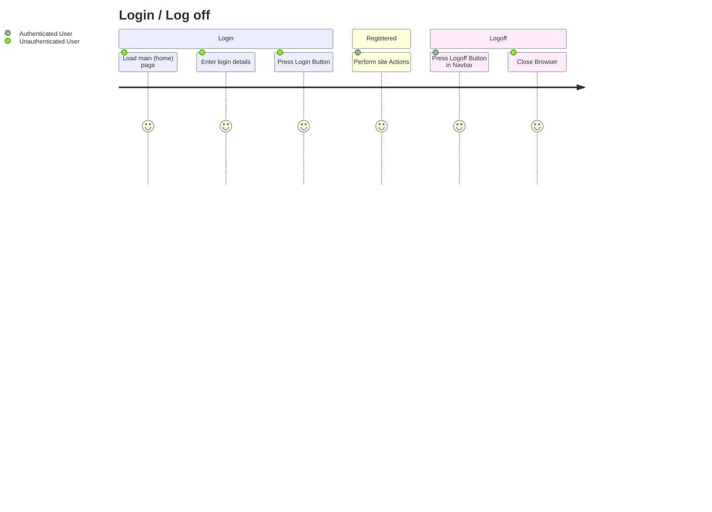
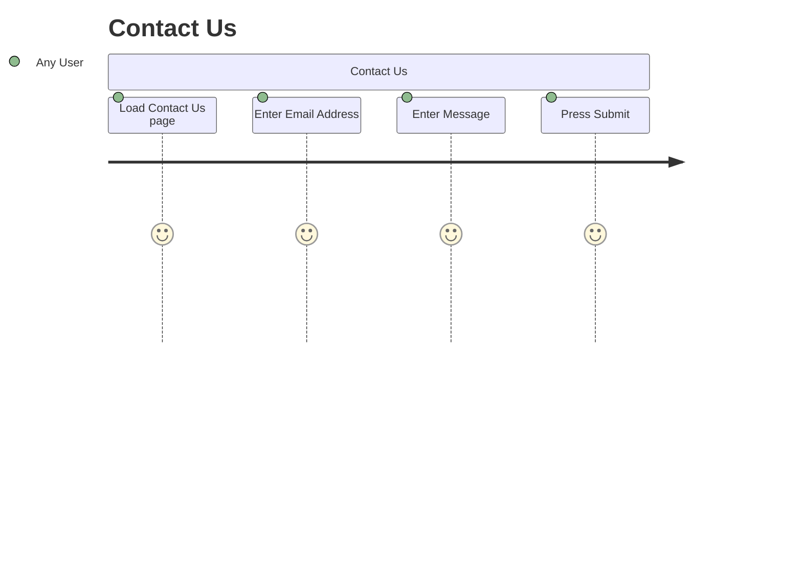
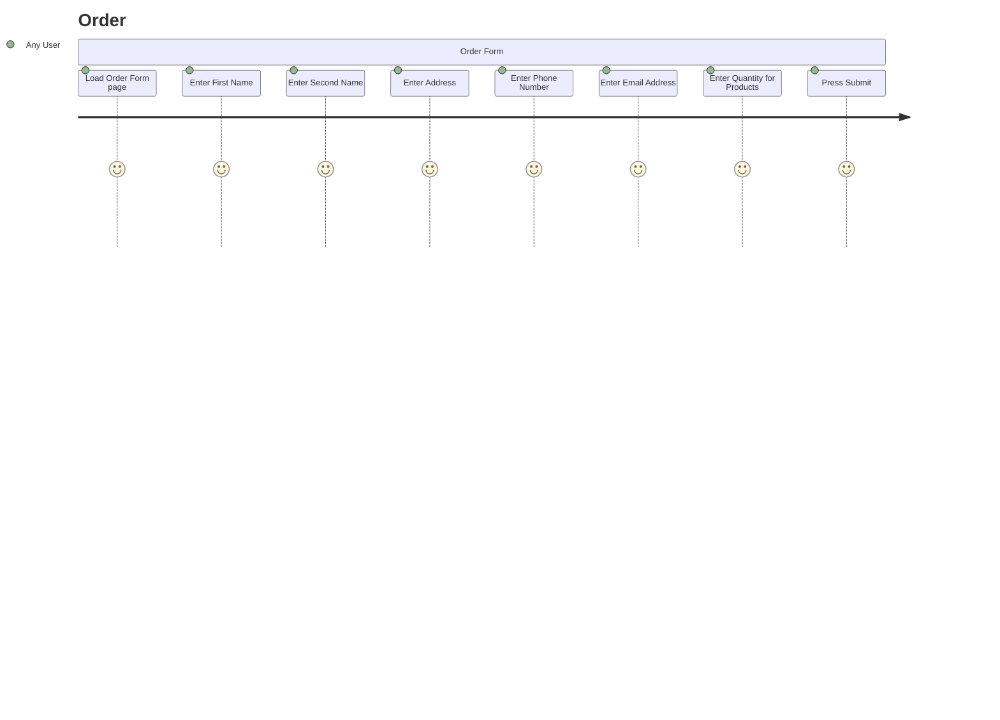
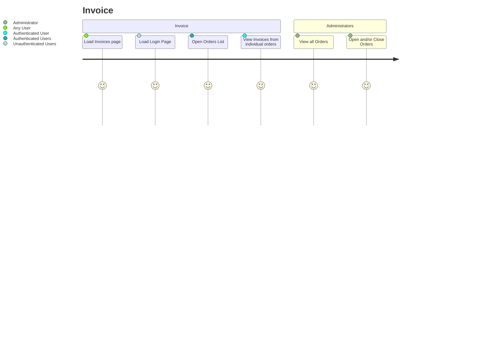
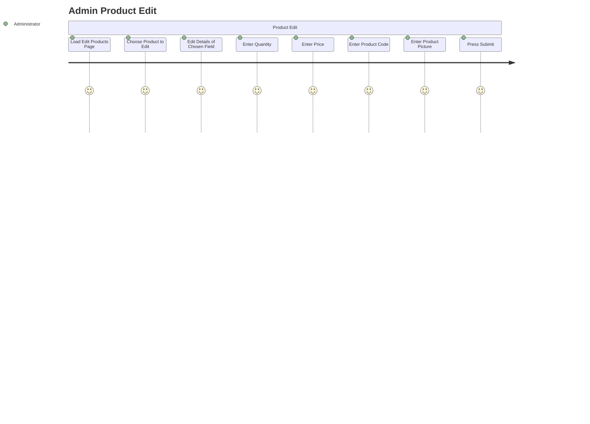
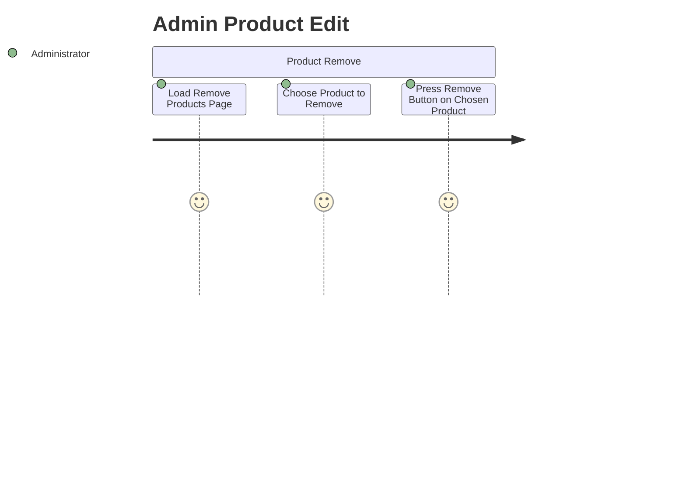

 # Project Overview
 
This site is a shopping cart website that sells chairs on the website. This website will be made using PHP. This website will allow users to register themselves for an account, login to that account and logout of that account. Other features of the page include a contact us page, where users can send a message to the administrators where they send their email as well for further conversations if needed. This website's main page, the shopping cart, allows the user to add the items and the amount wanted into a shopping cart where they can then order what is in their shopping cart. 
## User Management
A user can register themselves to make an account on the website, once a user has been registered, they have the ability to login and logout of the website as they please. 

Users will have names, their date of birth, access level and hashed password stored in the website.

There are two access levels for this website, administrator and user, administrator has the ability to change the website, open and close orders, and add, remove and edit products. Whereas users can only see the website and make no changes. Though a user can add make an order on the website. Someone who is nor a user or administrator has little to no access to the website. 

The user's account password will be stored as a hashed password, meaning no one will know the password of a user except for that user. 
## Product Management
Administrators of the website can add, remove or edit the products of the website. Each product will have a name, a price, a picture of the product, the description of the product and a quantity.
 
 # Behaviour User Journey

 # Planning Diagram - Wireframes

